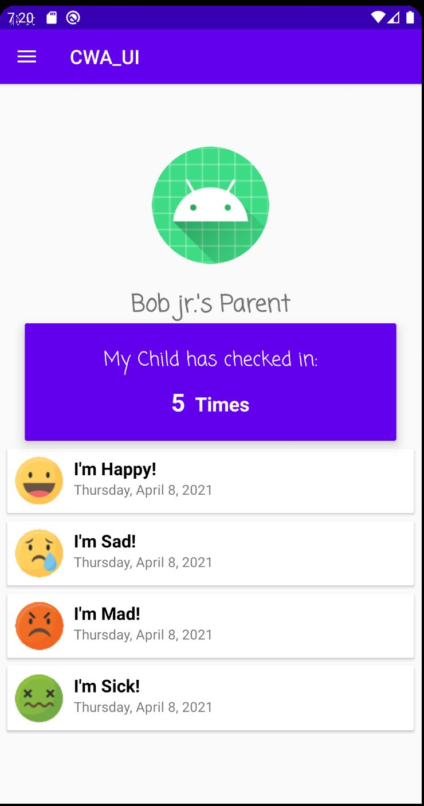
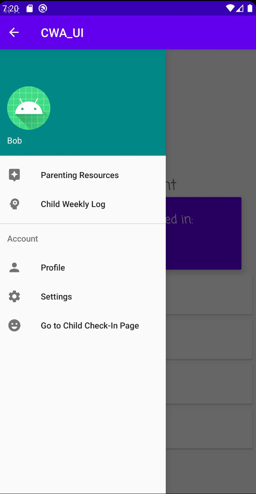
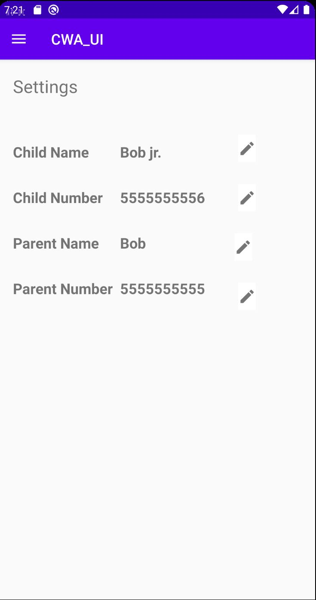
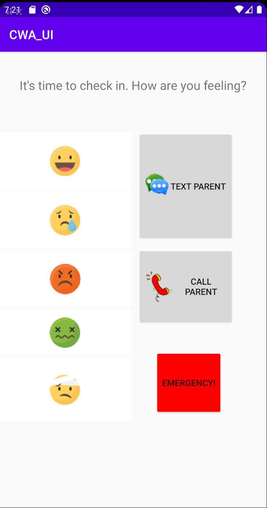
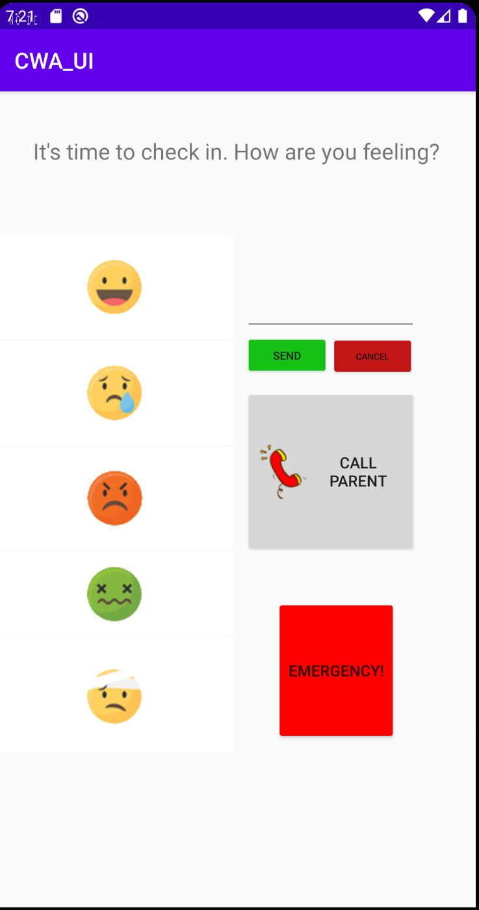
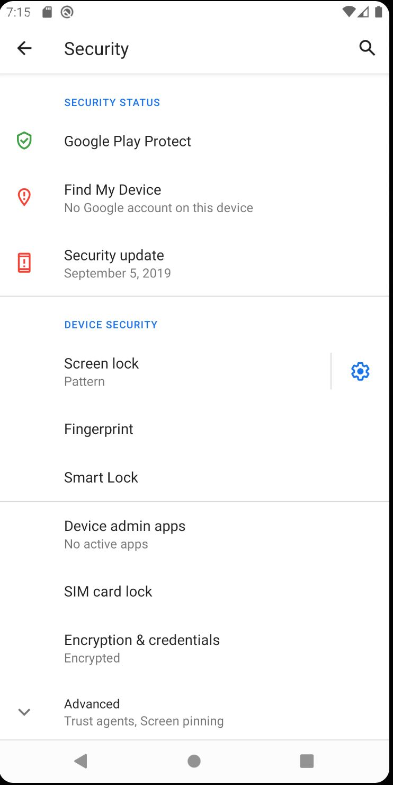
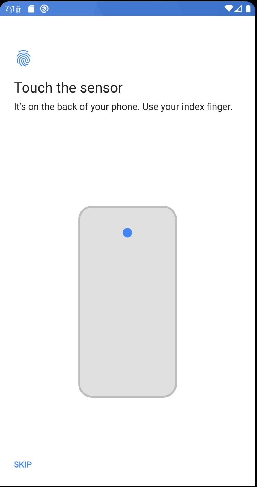
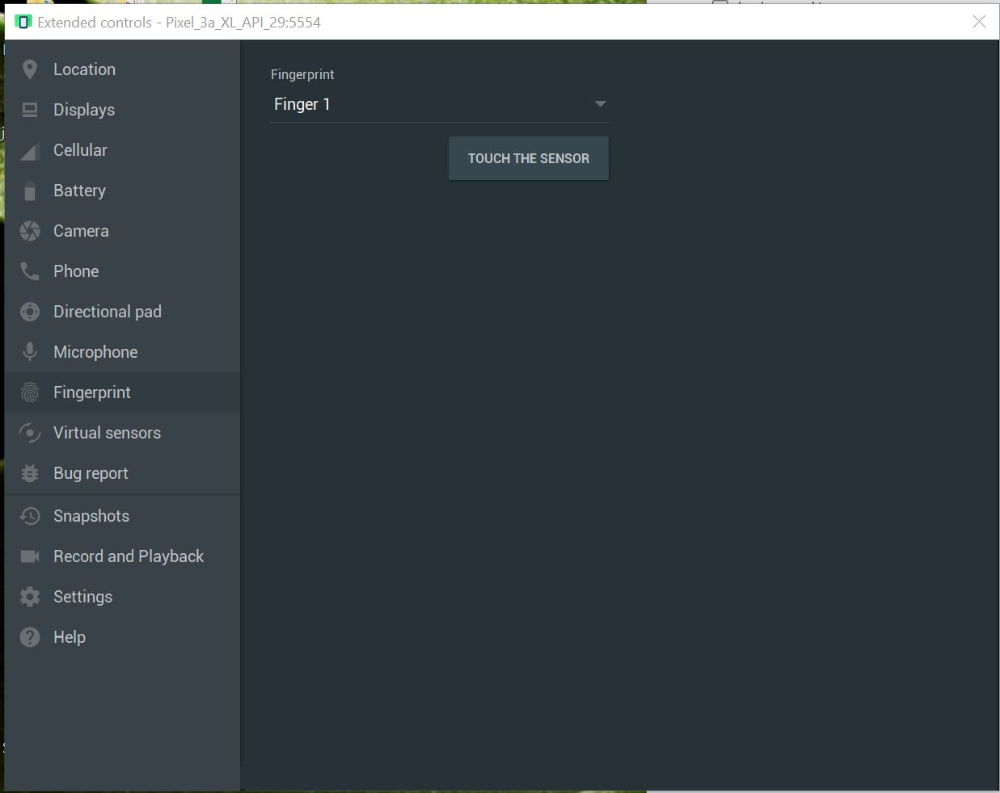

# csci-4230-spring-2021
# Team Beta

Team Members:  
Shay Merchant   Giuseppe Jeanty   Jahina Hayes   Nya Allen   Jared Decker   Rachel Williams

# Dependencies 
Android Studio  
IntelliJ 
Appium. 
Java / JDK  
Pixel 3a or Pixel 3a XL 
API 29 / Android 10.0 
Fingerprint permission 
GPS / Location permission 
Call permission 
Messenger permission 

# NEW USERS / EMULATOR USE:
Dependencies and Android Studio must be set up. 
This was tested using a Pixel 3a and 3a XL, along with an API 29.  
For the first run of the emulator, a location must be set in the emulator to use the emergency button. 
This can be done by going to (... -> Location -> Set Location) in the emulators tool bar. 
To use the biometric fingerprint login for the child user, the permission must be enabled, and a fingerprint stored. 
This can be done by going in the phone to (Settings -> Security -> Fingerprint -> "Choose a backup screen lock method") 
To store a fingerprint the user can go to (... -> Fingerprint -> Finger 1) then click "TOUCH THE SENSOR" to simulate a finger press  
A screenshot reference can be located at the bottom of the readme to assist you in setting these up. 
If you have trouble getting Android Studio running correctly, you may need to configure your SDK correctly,
or import your android project correctly.  

#PARENT UI:
Current working UI:

  

#CHILD UI:
Current working UI:
 

  

#LOCATION SETUP REFERENCE
 

  

#FINGERPRINT SETUP REFERENCE
 

 

 

  